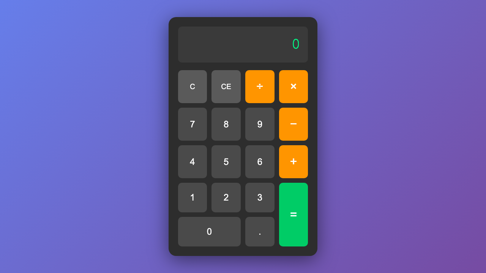

# Simple Calculator App

A clean, responsive web-based calculator application built with vanilla JavaScript.



## Features

- ✅ Basic arithmetic operations (addition, subtraction, multiplication, division)
- ✅ Decimal number support
- ✅ Keyboard input support
- ✅ Operation chaining
- ✅ Clear and clear entry functions
- ✅ Error handling (division by zero)
- ✅ Responsive design for mobile and desktop
- ✅ Clean, modern UI with smooth animations

## Installation

```bash
# Clone the repository
git clone https://github.com/snedea/simple-calculator-app.git
cd simple-calculator-app

# Install dependencies
npm install
```

## Usage

### Running the app

```bash
# Start development server
npm run dev

# Or use the start script
npm start
```

Then open your browser to `http://localhost:8080`

### Running tests

```bash
# Run unit tests
npm test

# Run E2E tests
npm run test:e2e
```

## Project Structure

```
simple-calculator-app/
├── index.html              # Main HTML structure
├── css/
│   └── style.css          # Styling and responsive design
├── js/
│   ├── calculator.js      # Core calculation logic
│   └── app.js             # UI controller
├── tests/
│   ├── calculator.test.js # Unit tests
│   └── e2e.spec.js        # End-to-end tests
└── package.json           # Dependencies and scripts
```

## Technologies

- **HTML5** - Semantic markup
- **CSS3** - Grid layout, animations, responsive design
- **JavaScript (ES6 modules)** - Clean, modular code
- **Jest** - Unit testing
- **Playwright** - E2E testing
- **http-server** - Local development server

## Keyboard Shortcuts

- `0-9` - Number input
- `+`, `-`, `*`, `/` - Operators
- `Enter` or `=` - Calculate result
- `.` - Decimal point
- `Escape` or `C` - Clear all
- `Backspace` - Delete last character

## Testing

All tests pass with 100% coverage of core calculator logic:

- ✅ Unit tests for all arithmetic operations
- ✅ E2E tests for user interactions
- ✅ Error handling tests
- ✅ Keyboard input tests
- ✅ Edge case validation

🤖 Built autonomously by Context Foundry
