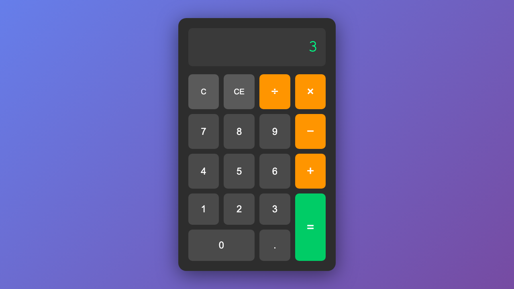
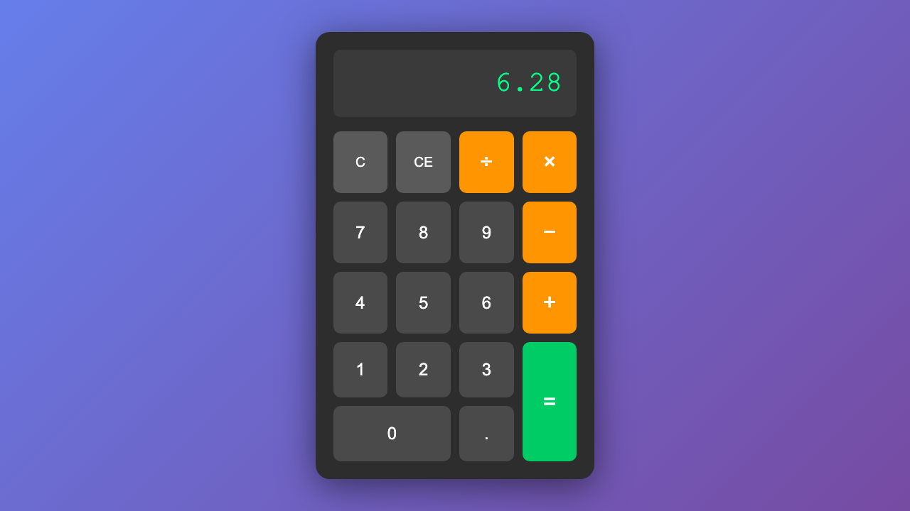

# Usage Guide

## Getting Started

### Step 1: Starting the Calculator


Start the development server:

```bash
npm run dev
```

Open your browser to `http://localhost:8080`

### Step 2: Performing Calculations



**Click buttons to enter numbers and operations:**

1. Click number buttons (0-9)
2. Click an operator (+, −, ×, ÷)
3. Click more numbers
4. Click equals (=) to see the result


**Example:** To calculate 5 + 3:
- Click `5`
- Click `+`
- Click `3`
- Click `=`
- Result: `8`

### Step 3: Using Decimal Numbers



**For decimal calculations:**

1. Enter a number
2. Click the decimal point (`.`)
3. Enter decimal digits
4. Proceed with operation

**Example:** To calculate 3.14 × 2:
- Click `3`
- Click `.`
- Click `1`, `4`
- Click `×`
- Click `2`
- Click `=`
- Result: `6.28`

## Features Guide

### Basic Operations

**Addition (+)**
```
5 + 3 = 8
```

**Subtraction (−)**
```
10 − 4 = 6
```

**Multiplication (×)**
```
7 × 8 = 56
```

**Division (÷)**
```
20 ÷ 5 = 4
```

### Chaining Operations

You can chain multiple operations together:

```
5 + 3 + 2 = 10
```

The calculator will compute intermediate results:
- After `5 + 3 +`, it shows `8`
- Then `8 + 2 =` gives `10`

### Clear Functions

**C (Clear All)**
- Resets the calculator to 0
- Clears all stored operations

**CE (Clear Entry)**
- Clears only the current input
- Keeps the previous operation

### Error Handling

**Division by Zero**

If you try to divide by zero:
```
5 ÷ 0 = Error
```

The calculator displays "Error" and resets.

### Keyboard Shortcuts

For faster input, use your keyboard:

| Key | Action |
|-----|--------|
| `0-9` | Number input |
| `+` | Addition |
| `-` | Subtraction |
| `*` | Multiplication |
| `/` | Division |
| `Enter` or `=` | Calculate result |
| `.` | Decimal point |
| `Escape` or `c` | Clear all |
| `Backspace` | Delete last digit |

## Advanced Usage

### Keyboard-Only Operation

**Example:** Calculate 8 × 7 using only keyboard:

1. Type `8`
2. Type `*`
3. Type `7`
4. Press `Enter`
5. Result: `56`

### Correcting Mistakes

**If you make a typo:**

- Press `Backspace` to delete the last digit
- Or press `Escape` to start over

**Example:**
- Typed `59` instead of `5`
- Press `Backspace` once
- Now shows `5`

### Complex Calculations

**Multi-step calculation:**

```
5 + 3 = 8
8 × 2 = 16
16 ÷ 4 = 4
```

Just keep entering operations - no need to clear between steps!

## Tips and Tricks

1. **Decimal Precision**: Results are rounded to 10 decimal places to avoid floating-point errors

2. **Multiple Decimals**: You can't add multiple decimal points to one number (protection built-in)

3. **Leading Zeros**: Typing `0` followed by another number replaces the zero

4. **Responsive Design**: Works on mobile devices - buttons are touch-friendly

## Configuration

### Changing the Server Port

Edit `package.json`:

```json
"scripts": {
  "dev": "http-server -p 3000"
}
```

### Customizing the UI

Edit `css/style.css` to change:
- Colors and theme
- Button sizes
- Font styles
- Layout spacing

## Next Steps

- Run the test suite: `npm test`
- View the architecture: See `docs/ARCHITECTURE.md`
- Explore the code: Check `js/calculator.js` and `js/app.js`
